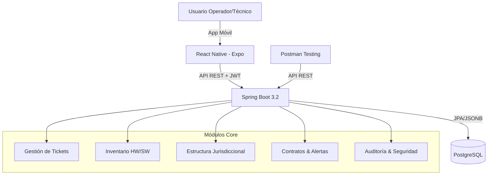

# ESPECIFICACIÓN FUNCIONAL: SISTEMA DE GESTIÓN JUDICIAL (HelpDesk & Inventario)
## Cliente: Poder Judicial - Dirección de Informática

### 1. Resumen Ejecutivo
El sistema centraliza y moderniza la gestión de soporte técnico e inventario informático del Poder Judicial, resolviendo la problemática de dispersión geográfica y falta de trazabilidad. Reemplaza procesos manuales (planillas, correos) con una plataforma web unificada que integra seis áreas funcionales clave: Mesa de Ayuda, Inventario de Hardware, Inventario de Software, Gestión de Contratos, Organización Territorial y Seguridad.

### 2. Alcance y Objetivos
- **Trazabilidad Total:** Control absoluto sobre el ciclo de vida de los activos y tickets ("Nada se borra").
- **Organización Territorial:** Reflejo fiel de la estructura jerárquica judicial (Circunscripciones, Distritos, Edificios, Juzgados).
- **Gestión Proactiva:** Alertas automáticas de vencimiento de contratos y garantías.
- **Acceso Granular:** Seguridad basada en roles con menús dinámicos.

### 3. Arquitectura Técnica
- **Frontend:** React Native (Expo) + React Navigation.
- **Backend:** Spring Boot 3.2 (Java 17) + Spring Data JPA + Spring Security.
- **Base de Datos:** PostgreSQL 16 (Soporte JSONB para flexibilidad de inventario). H2 para desarrollo.
- **Auth:** JWT + BCrypt.
- **API Docs:** SpringDoc OpenAPI (Swagger UI).
- **API Testing:** Postman.
- **Infraestructura:** Contenedores (Docker/Kubernetes).

### 4. Módulos Funcionales

#### 4.1 Organización Territorial
El sistema estructura la información basándose en la jerarquía geográfica real:
1.  **Circunscripciones:** División territorial mayor.
2.  **Distritos Judiciales:** Subdivisión (ej: Santa Fe, Rosario).
3.  **Ciudades y Edificios:** Localidades e inmuebles físicos.
4.  **Juzgados:** Unidad operativa central. A esta entidad se asocian equipos, personas, puestos y tickets.

#### 4.2 Gestión de Inventario (Hardware y Software)
Rastreo individual y clasificado de cada activo:
-   **Categorización:** Clase (PC, Servidor), Tipo (Desktop, All-in-One), Marca, Modelo.
-   **Identificación:** N° Inventario Patrimonial (Formato: `INV-XXX-0000`), N° Serie, Juzgado asignado, Ubicación física (Puesto).
-   **Ciclo de Vida:** Historial completo de cambios de estado y ubicación.

#### 4.3 Gestión de Contratos y Alertas
Control de proveedores externos y garantías:
-   **Ficha de Contrato:** Proveedor, fechas de vigencia (Inicio/Fin), cobertura HW/SW, SLA.
-   **Alertas Automáticas:**
    -   *Urgente:* Vencimiento inminente (días configurables).
    -   *Por Vencer:* Aviso preventivo.
    -   Visualización destacada en Dashboard (Semáforos).

#### 4.4 Mesa de Ayuda (Tickets)
Ciclo de vida del incidente técnico:
-   **Estados:**
    1.  *Solicitado:* Creación inicial.
    2.  *Asignado:* Derivación a técnico o proveedor.
    3.  *En Curso:* Trabajo activo.
    4.  *Cerrado:* Resolución final documentada.
-   **Datos Clave:** ID automático, Asunto, Prioridad (Alta/Media/Baja), Juzgado, Activo afectado (vinculación con Inventario), Bitácora.
-   **Reglas de Negocio:**
    -   Si afecta a Juez o Sala de Audiencias -> **Prioridad ALTA** automática.
    -   Si es hardware -> Obligatorio vincular N° Inventario.
    -   **Escalamiento Automático:** Si un ticket de *Prioridad ALTA* permanece en estado *Solicitado* por más de 4 horas sin asignación, se notifica automáticamente al Supervisor de Área.

#### 4.5 Portal de Autoservicio
Interfaz simplificada para usuarios finales (Jueces, Secretarios, Empleados):
-   **Catálogo de Servicios:** Botones rápidos para incidentes comunes (ej: "No tengo internet", "Impresora atascada", "Solicitar tóner").
-   **Mis Tickets:** Vista para consultar el estado y bitácora de los reclamos propios.
-   **Base de Conocimiento (FAQ):** Soluciones rápidas a problemas frecuentes para fomentar la autogestión.

#### 4.6 Estrategia Multicanal
Integración de múltiples canales de entrada unificados en la Mesa de Ayuda:
-   **Web (Operador):** Carga manual completa.
-   **Portal de Autoservicio:** Carga simplificada por el usuario.
-   **Email-to-Ticket:** Los correos enviados a `soporte@poderjudicial.gov.ar` generan automáticamente un ticket en estado *Solicitado*. Se parsea el asunto como Título y el cuerpo como Descripción.
-   **Chatbot (Fase 2):** Asistente virtual en intranet para consultas rápidas y derivación a ticket si no se resuelve.

#### 4.7 Seguridad y Auditoría
-   **Perfiles (RBAC):**
    -   *Operador de Mesa:* Crea y asigna tickets.
    -   *Técnico:* Resuelve y cierra tickets.
    -   *Gestor de Inventario:* ABM de activos y contratos.
    -   *Auditor:* Solo lectura, acceso a logs y métricas.
    -   *Admin:* Acceso total.
-   **Auditoría Inmutable:** Registro de *quién*, *cuándo*, *qué* cambió (valor anterior vs nuevo). Los registros no se eliminan físicamente (Soft Delete).

### 5. Dashboard y Métricas
Visualización en tiempo real para toma de decisiones:
-   Casos Abiertos vs Cerrados (Mes actual).
-   Tickets de Prioridad Alta pendientes.
-   Contratos en estado Crítico/Vencido.
-   Eficacia de resolución.

### 6. Cronograma de Implementación (Estimado)
-   **Fase 1:** Fundamentos, Seguridad y Estructura Territorial.
-   **Fase 2:** Inventario y Contratos (Carga inicial).
-   **Fase 3:** Mesa de Ayuda (Core operativo) + Portal de Autoservicio.
-   **Fase 4:** Integración Multicanal (Email), Reportes avanzados y Auditoría.
