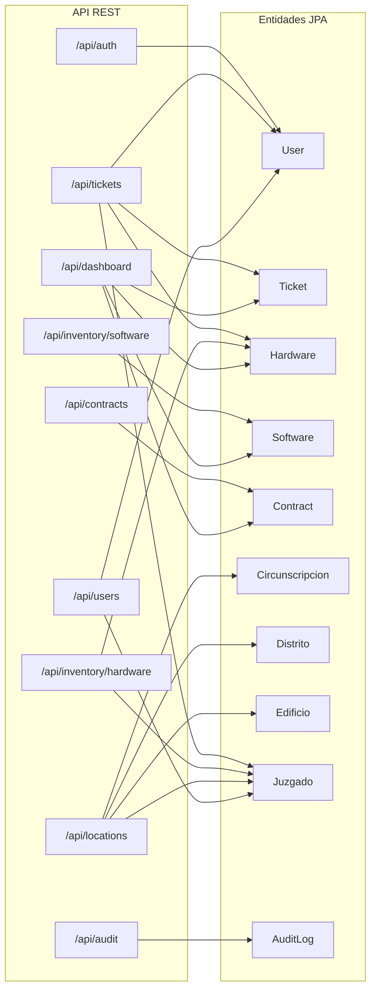

# Mapa de Endpoints — API REST SOJUS

> **Base URL:** `http://localhost:8080`  
> **Autenticación:** JWT Bearer Token (excepto `/api/auth/login`)  
> **Documentación interactiva:** [Swagger UI](http://localhost:8080/swagger-ui.html) | [OpenAPI JSON](http://localhost:8080/api-docs)

---

## Resumen por Módulo

| Módulo | Base Path | Métodos | Entidad(es) |
|--------|-----------|:-------:|-------------|
| Autenticación | `/api/auth` | 2 | `User` |
| Mesa de Ayuda | `/api/tickets` | 4 | `Ticket`, `User`, `Hardware`, `Juzgado` |
| Inventario HW | `/api/inventory/hardware` | 5 | `Hardware`, `Juzgado` |
| Inventario SW | `/api/inventory/software` | 5 | `Software` |
| **Contratos** | **`/api/contracts`** | **6** | **`Contract`** |
| Ubicaciones | `/api/locations` | 3 | `Circunscripcion`, `Distrito`, `Edificio`, `Juzgado` |
| Usuarios | `/api/users` | 5 | `User`, `Juzgado` |
| Auditoría | `/api/audit` | 2 | `AuditLog` |
| Dashboard | `/api/dashboard` | 1 | Agregaciones |
| **TOTAL** | | **33** | |

---

## 1. Autenticación (`/api/auth`)

| # | Método | Endpoint | Descripción | Auth | Request Body | Response |
|---|--------|----------|-------------|:----:|-------------|----------|
| 1 | `POST` | `/api/auth/login` | Iniciar sesión | ❌ | `LoginRequest { username, password }` | `LoginResponse { token, username, role }` |
| 2 | `GET` | `/api/auth/me` | Obtener usuario autenticado | ✅ | — | `{ id, username, fullName, role, email }` |

---

## 2. Mesa de Ayuda — Tickets (`/api/tickets`)

| # | Método | Endpoint | Descripción | Auth | Request Body | Response |
|---|--------|----------|-------------|:----:|-------------|----------|
| 3 | `GET` | `/api/tickets` | Listar todos los tickets | ✅ | — | `List<TicketResponse>` |
| 4 | `GET` | `/api/tickets/{id}` | Obtener ticket por ID | ✅ | — | `TicketResponse` |
| 5 | `POST` | `/api/tickets` | Crear nuevo ticket | ✅ | `TicketRequest { asunto, descripcion, prioridad, juzgadoId, hardwareId }` | `TicketResponse` (201) |
| 6 | `PATCH` | `/api/tickets/{id}/status` | Cambiar estado del ticket | ✅ | `StatusChangeRequest { status, comentario, tecnicoId }` | `TicketResponse` |
| 7 | `DELETE` | `/api/tickets/{id}` | Eliminar ticket (soft delete) | ✅ | — | `204 No Content` |

**Entidades mapeadas:** `Ticket` → `User` (solicitante/técnico), `Juzgado`, `Hardware`

---

## 3. Inventario — Hardware (`/api/inventory/hardware`)

| # | Método | Endpoint | Descripción | Auth | Request Body | Response |
|---|--------|----------|-------------|:----:|-------------|----------|
| 8 | `GET` | `/api/inventory/hardware` | Listar todo el hardware | ✅ | — | `List<Hardware>` |
| 9 | `GET` | `/api/inventory/hardware/{id}` | Obtener hardware por ID | ✅ | — | `Hardware` |
| 10 | `POST` | `/api/inventory/hardware` | Crear nuevo hardware | ✅ | `Hardware { inventarioPatrimonial, clase, tipo, marca, modelo, juzgadoId }` | `Hardware` (201) |
| 11 | `PUT` | `/api/inventory/hardware/{id}` | Actualizar hardware | ✅ | `Hardware` (completo) | `Hardware` |
| 12 | `DELETE` | `/api/inventory/hardware/{id}` | Eliminar hardware (soft delete) | ✅ | — | `204 No Content` |

**Entidades mapeadas:** `Hardware` → `Juzgado`

---

## 4. Inventario — Software (`/api/inventory/software`)

| # | Método | Endpoint | Descripción | Auth | Request Body | Response |
|---|--------|----------|-------------|:----:|-------------|----------|
| 13 | `GET` | `/api/inventory/software` | Listar todo el software | ✅ | — | `List<Software>` |
| 14 | `GET` | `/api/inventory/software/{id}` | Obtener software por ID | ✅ | — | `Software` |
| 15 | `POST` | `/api/inventory/software` | Crear nuevo software | ✅ | `Software { nombre, version, fabricante, tipoLicencia }` | `Software` (201) |
| 16 | `PUT` | `/api/inventory/software/{id}` | Actualizar software | ✅ | `Software` (completo) | `Software` |
| 17 | `DELETE` | `/api/inventory/software/{id}` | Eliminar software (soft delete) | ✅ | — | `204 No Content` |

**Entidades mapeadas:** `Software` (independiente)

---

## 5. Contratos (`/api/contracts`)

| # | Método | Endpoint | Descripción | Auth | Request Body | Response |
|---|--------|----------|-------------|:----:|-------------|----------|
| 18 | `GET` | `/api/contracts` | Listar contratos activos | ✅ | — | `List<Contract>` |
| 19 | `GET` | `/api/contracts/{id}` | Obtener contrato por ID | ✅ | — | `Contract` |
| 20 | `POST` | `/api/contracts` | Crear nuevo contrato | ✅ | `Contract { nombre, proveedor, numeroContrato, fechaInicio, fechaFin, coberturaHw, coberturaSw, slaDescripcion }` | `Contract` (201) |
| 21 | `PUT` | `/api/contracts/{id}` | Actualizar contrato | ✅ | `Contract` (completo) | `Contract` |
| 22 | `DELETE` | `/api/contracts/{id}` | Desactivar contrato | ✅ | — | `204 No Content` |
| 23 | `GET` | `/api/contracts/expiring` | Contratos próximos a vencer | ✅ | Query: `?days=30` | `List<Contract>` |

### Modelo de datos — Contract

```json
{
  "id": 1,
  "nombre": "Mantenimiento de PCs",
  "proveedor": "TechCorp SRL",
  "numeroContrato": "CONT-2025-001",
  "fechaInicio": "2025-01-01",
  "fechaFin": "2026-12-31",
  "coberturaHw": "PCs de escritorio y notebooks",
  "coberturaSw": null,
  "slaDescripcion": "Respuesta en 4 horas hábiles. Resolución en 24 horas.",
  "observaciones": null,
  "active": true,
  "createdAt": "2026-02-25T08:00:00",
  "updatedAt": null
}
```

### Ejemplo — Crear contrato (cURL):

```bash
curl -X POST http://localhost:8080/api/contracts \
  -H "Authorization: Bearer <JWT_TOKEN>" \
  -H "Content-Type: application/json" \
  -d '{
    "nombre": "Soporte Anual Impresoras",
    "proveedor": "PrintServices SA",
    "numeroContrato": "CONT-2026-005",
    "fechaInicio": "2026-03-01",
    "fechaFin": "2027-03-01",
    "coberturaHw": "Impresoras Brother y HP",
    "slaDescripcion": "Respuesta en 8h hábiles"
  }'
```

### Ejemplo — Consultar contratos próximos a vencer:

```bash
# Contratos que vencen en los próximos 60 días
curl http://localhost:8080/api/contracts/expiring?days=60 \
  -H "Authorization: Bearer <JWT_TOKEN>"
```

**Entidades mapeadas:** `Contract` (independiente, alertas por `fechaFin`)

---

## 6. Estructura Territorial (`/api/locations`)

| # | Método | Endpoint | Descripción | Auth | Request Body | Response |
|---|--------|----------|-------------|:----:|-------------|----------|
| 24 | `GET` | `/api/locations/circunscripciones` | Listar circunscripciones con jerarquía | ✅ | — | `List<Circunscripcion>` (incluye distritos → edificios → juzgados) |
| 25 | `GET` | `/api/locations/juzgados` | Listar todos los juzgados activos | ✅ | — | `List<Juzgado>` |
| 26 | `GET` | `/api/locations/edificios/{edificioId}/juzgados` | Juzgados de un edificio | ✅ | — | `List<Juzgado>` |

**Entidades mapeadas:** `Circunscripcion` → `Distrito` → `Edificio` → `Juzgado` (jerarquía territorial)

---

## 7. Usuarios (`/api/users`)

| # | Método | Endpoint | Descripción | Auth | Request Body | Response |
|---|--------|----------|-------------|:----:|-------------|----------|
| 27 | `GET` | `/api/users` | Listar usuarios activos | ✅ | — | `List<User>` |
| 28 | `GET` | `/api/users/{id}` | Obtener usuario por ID | ✅ | — | `User` |
| 29 | `GET` | `/api/users/role/{role}` | Listar usuarios por rol | ✅ | Path: `ADMINISTRADOR\|TECNICO\|OPERADOR` | `List<User>` |
| 30 | `POST` | `/api/users` | Crear nuevo usuario | ✅ | `User { username, password, fullName, email, role, juzgadoId }` | `User` (201) |
| 31 | `PUT` | `/api/users/{id}` | Actualizar usuario | ✅ | `User` (completo) | `User` |
| 32 | `DELETE` | `/api/users/{id}` | Eliminar usuario (soft delete) | ✅ | — | `204 No Content` |

**Entidades mapeadas:** `User` → `Juzgado`, `RoleName` (enum)

---

## 8. Auditoría (`/api/audit`)

| # | Método | Endpoint | Descripción | Auth | Request Body | Response |
|---|--------|----------|-------------|:----:|-------------|----------|
| 33 | `GET` | `/api/audit` | Últimos 100 registros de auditoría | ✅ | — | `List<AuditLog>` |
| 34 | `GET` | `/api/audit/entity/{entityName}/{entityId}` | Historial de una entidad | ✅ | Path: ej. `Ticket/5` | `List<AuditLog>` |

**Entidades mapeadas:** `AuditLog` (log inmutable — solo lectura)

---

## 9. Dashboard (`/api/dashboard`)

| # | Método | Endpoint | Descripción | Auth | Request Body | Response |
|---|--------|----------|-------------|:----:|-------------|----------|
| 35 | `GET` | `/api/dashboard/stats` | Estadísticas generales | ✅ | — | `DashboardStats { ticketsAbiertos, ticketsCerrados, ticketsAlta, hwTotal, swTotal, contractsExpiring }` |

**Entidades mapeadas:** Agregaciones sobre `Ticket`, `Hardware`, `Software`, `Contract`

---

## Códigos de Respuesta HTTP

| Código | Significado | Uso |
|:------:|-------------|-----|
| `200` | OK | Lectura / actualización exitosa |
| `201` | Created | Recurso creado exitosamente |
| `204` | No Content | Eliminación exitosa |
| `400` | Bad Request | Validación fallida |
| `401` | Unauthorized | Token JWT ausente o inválido |
| `403` | Forbidden | Sin permisos para la operación |
| `404` | Not Found | Recurso no encontrado |
| `500` | Internal Server Error | Error del servidor |

---

## Diagrama de Relaciones Endpoint ↔ Entidad


